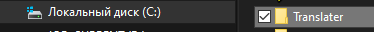
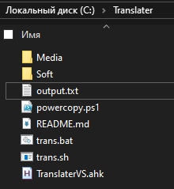

<p align="center">
    <p align="center">
        <a href="https://sites.google.com/view/dvurechensky" target="_blank"></a>
        
        
    </p>
</p>

<p align="center">
    <h1 align="center">🌟Переводчик Windows🌟<h1>
    <br>
</p>

<p align="center">
    
</p>

<p align="center">
    <h3 align="center">🙌Что это?🙌<h3>
    <h5 align="center">Этот проект может в небольших объёмах ⚡переводить⚡ англоязычный текст на 🐟русский🐟 в любом редакторе - Word, Visual Code, Visual Studio, хоть в строке поиска яндекс ✌️, он переведёт и вставит русский вариант интерактивно. Тебе просто надо выделить текст и нажать комбинацию клавиш описанную ниже 👊<h5>
    <br>
</p>

<p align="center">
    <h3 align="center">🙌Необходимые компоненты🙌<h3>
    <br>
</p>

💢 [AutoHotKey_2.0.11](https://ahk-wiki.ru/) (и выше) - в папке ***Soft***
-
💢 [PowerShell](https://learn.microsoft.com/en-us/powershell/scripting/install/installing-powershell-on-windows?view=powershell-7.4)
-
💢 [Cygwin](https://www.cygwin.com/install.html) - в папке ***Soft***
-

<p align="center">
    <br>
    <h3 align="center">😈Установка😈<h3>
    <br>
</p>

1. Извлеките содержимое проекта в папку Translater


2. Зайдите в консоль *Cygwin64 Terminal* и введите
> выдаём права на исполнение скриптам
```bash
chmod -R +x /cygdrive/c/Translater
```
3. После установки необходимых программ просто запустите ***TranslaterVS.ahk*** двойным нажатием мыши на него
4. Выделите английский текст и нажмите на ***колёсик мышки*** предварительно зажав клавишу ***Ctrl***, он переведёт текст и вставит вместо выделенного или в место последнего положения курсора

<p align="center">
    <br>
    <h3 align="center">💝 Ремарка 💝<h3>
    <br>
</p>
Алгоритм делался изначально под перевод англоязычных комментариев в скриптах Visual Studio, но он получился настолько крут, что умеет это везде! С тебя подписка 💥