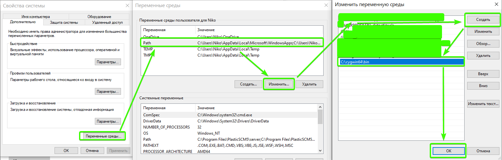
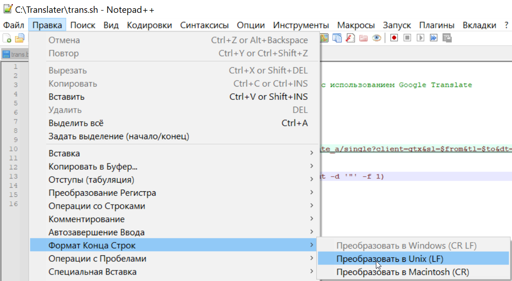
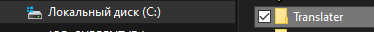
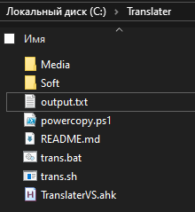
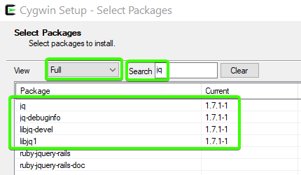

<p align="center">
    <p align="center">
        <a href="https://sites.google.com/view/dvurechensky" target="_blank"></a>
        
        
        
    </p>
</p>

<p align="center">
    <h1 align="center">🌟Windows Translator🌟<h1>
    <br>
</p>

<div align="center" style="margin: 20px 0; padding: 10px; background: #1c1917; border-radius: 10px;">
  <strong>🌐 Language: </strong>
  
  <a href="./README.ru.md" style="color: #F5F752; margin: 0 10px;">
    🇷🇺 Russian
  </a>
  | 
  <span style="color: #0891b2; margin: 0 10px;">
    ✅ 🇺🇸 English (current)
  </span>
</div>

<p align="center">
    
</p>

<p align="center">
    <h3 align="center">🙌What is this?🙌<h3>
    <h5 align="center">
        This project can ⚡translate⚡ small amounts of English text into 🐟Russian🐟 
        in any editor — Word, Visual Studio Code, Visual Studio, or even a browser search bar ✌️.  
        It translates and inserts the result interactively.  
        Just select the text and press the key combination described below 👊
    <h5>
    <br>
</p>

<p align="center">
    <h3 align="center">🙌Requirements🙌<h3>
    <br>
</p>

## 💢 [AutoHotKey_2.0.11](https://ahk-wiki.ru/) (or higher) — located in **_Soft_** folder

## 💢 [PowerShell](https://learn.microsoft.com/en-us/powershell/scripting/install/installing-powershell-on-windows?view=powershell-7.4)

## 💢 [Cygwin](https://www.cygwin.com/install.html) — located in **_Soft_** folder

<p align="center">
    <br>
    <h3 align="center">😈Installation😈<h3>
    <br>
</p>

> ---
>
> 0. Install Cygwin on drive C and add `C:\cygwin64\bin` to the PATH environment variable  
>     **_(bash package is required)_**  
>    

0.1. Convert line endings in `C:\Translater\trans.sh` from CRLF to LF  


> ---

1. Extract the project contents into the `C:\Translater` folder  
     
   
   > ***

2.1 Install the `jq` package in Cygwin

> Required for the translator script to work

---

## 

2. Open _Cygwin64 Terminal_ and run:
   > grant execution permissions to scripts

```bash
chmod -R +x /cygdrive/c/Translater
```
